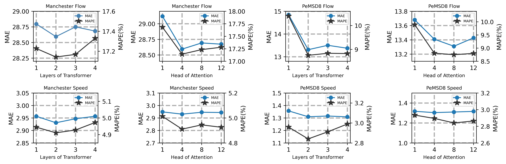
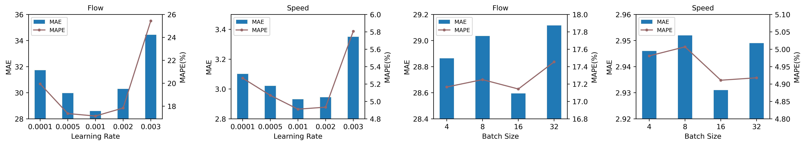
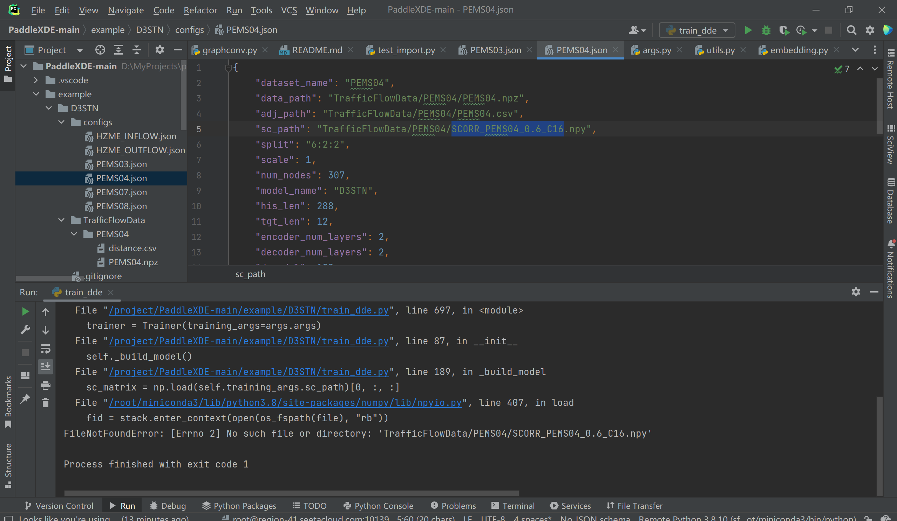

# MTNet
This is the pytorch implementation of MTNet. MTNet is a multi-task learning framework for joint traffic flow and speed prediction, built on a Transformer-like Encoder-Decoder architecture. 


## Model Comparison
The folder 'Model Comparison' contains the training logs of MTNet and Benchmarks.

## Hyperparameter Experiments

Due to space limitations in the paper, we do not include a detailed discussion of hyperparameter effects there. Instead, we provide a more comprehensive view here to aid understanding and reproducibility.

We conducted extensive hyperparameter experiments to investigate their impact on model performance, including the number of decoder layers, the number of attention heads, the learning rate, and the batch size.

We performed these experiments on both Manchester and PeMSD8; similar conclusions apply to PeMSD4.

- **Number of Decoder Layers**: Results show that **2 decoder layers** achieve the best performance.  
- **Number of Attention Heads**: Optimal results are achieved with **4 attention heads** on Manchester, and **8 attention heads** on PeMSD8 and PeMSD4. 
- **Learning Rate**: The performance curve is **concave**, with the best performance at **0.001**.  
- **Batch Size**: The model shows **low sensitivity** to batch size.






## D³STN Failed Experiment


## Required Packages

```
pytorch>=1.11
numpy
pandas
matplotlib
pyyaml
pickle
torchinfo
```

## Datasets

We use the following datasets in our experiments:

- **Manchester**   
  - **Source**: [Baidu NetDisk](https://pan.baidu.com/s/1YpZa1mYI3uOHl7lKKHjM_Q) (code: `jtmc`) The shared folder contains detailed preprocessing scripts and documentation.
  - **Preprocessing**: `data_prepare.py`

- **PEMS04 and PEMS08**   
  - **Source**: PeMSD4 and PeMSD8 datasets used in our experiments were released by and are available from the [ASTGCN repository](https://github.com/Davidham3/ASTGCN-2019-mxnet/tree/master/data).
  - **Preprocessing**: `data_prepare.py`
 
## Training Commands

```bash
cd model/
python train.py -d <dataset> -g <gpu_id>
```

`<dataset>`:
- PEMS04
- PEMS08
- Manchester
