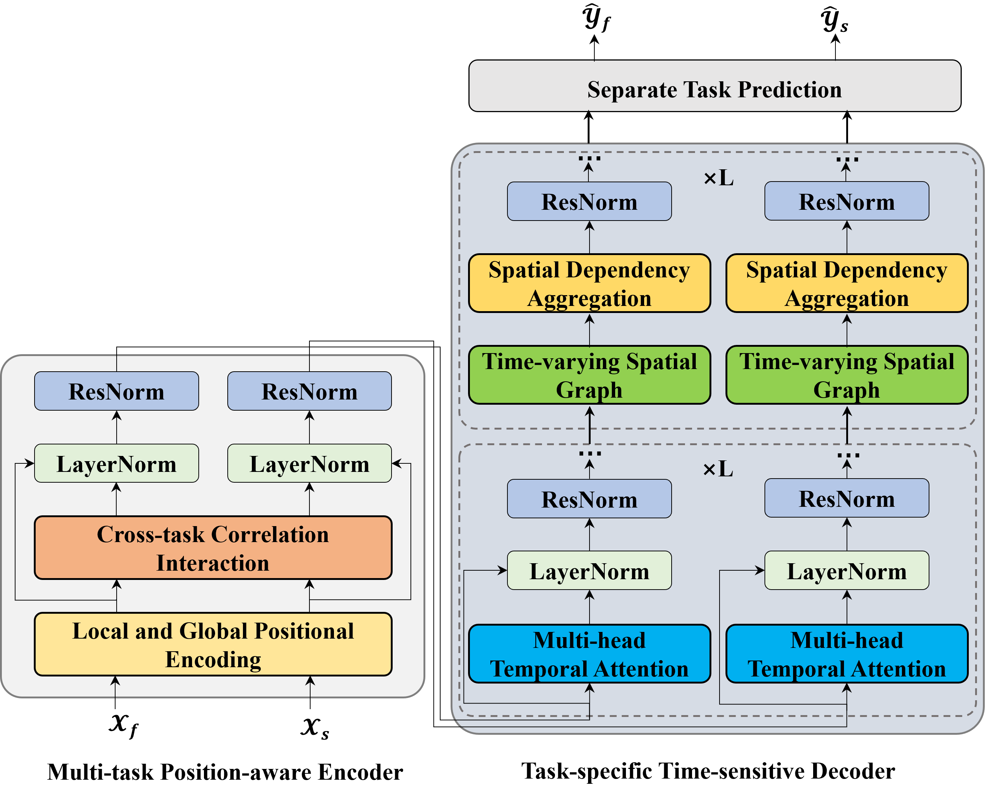

# MTNet
This is the pytorch implementation of MTNet. MTNet is a multi-task learning framework for joint traffic flow and speed prediction, built on a Transformer-like Encoder-Decoder architecture. 



## Model Comparison
The folder 'Model Comparison' contains the training logs of MTNet and Benchmarks.

## Required Packages

```
pytorch>=1.11
numpy
pandas
matplotlib
pyyaml
pickle
torchinfo
```

## Datasets
We use the following datasets in our experiments:

-Manchester
Download from Baidu NetDisk (code: jtmc) and preprocess with prepareManchester.py.

-PEMS04 and PEMS08
Provided by STSGCN. Please follow their instructions for data preparation.

## Training Commands

```bash
cd model/
python train.py -d <dataset> -g <gpu_id>
```

`<dataset>`:
- PEMS04
- PEMS08
- Manchester

